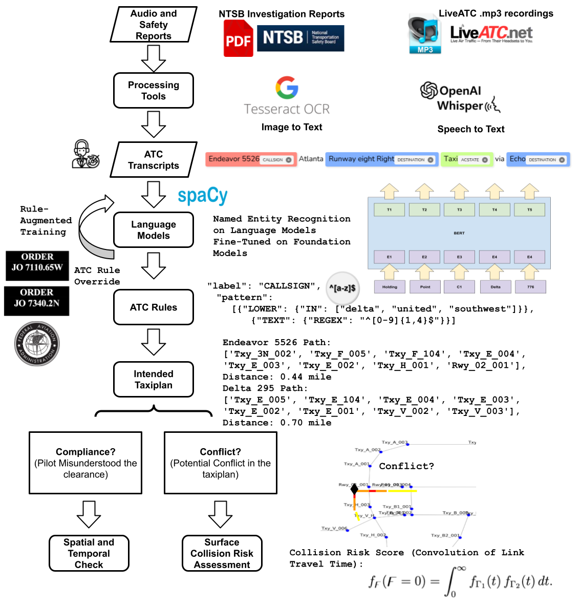
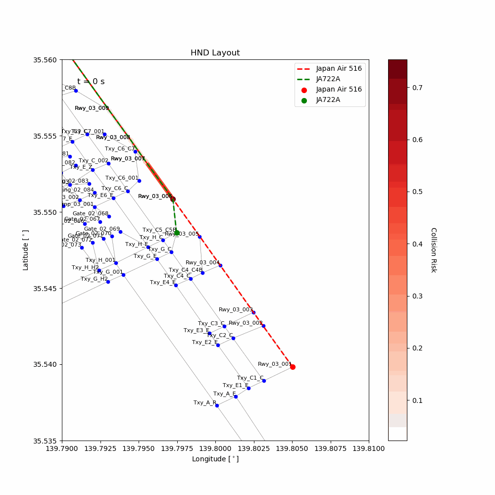
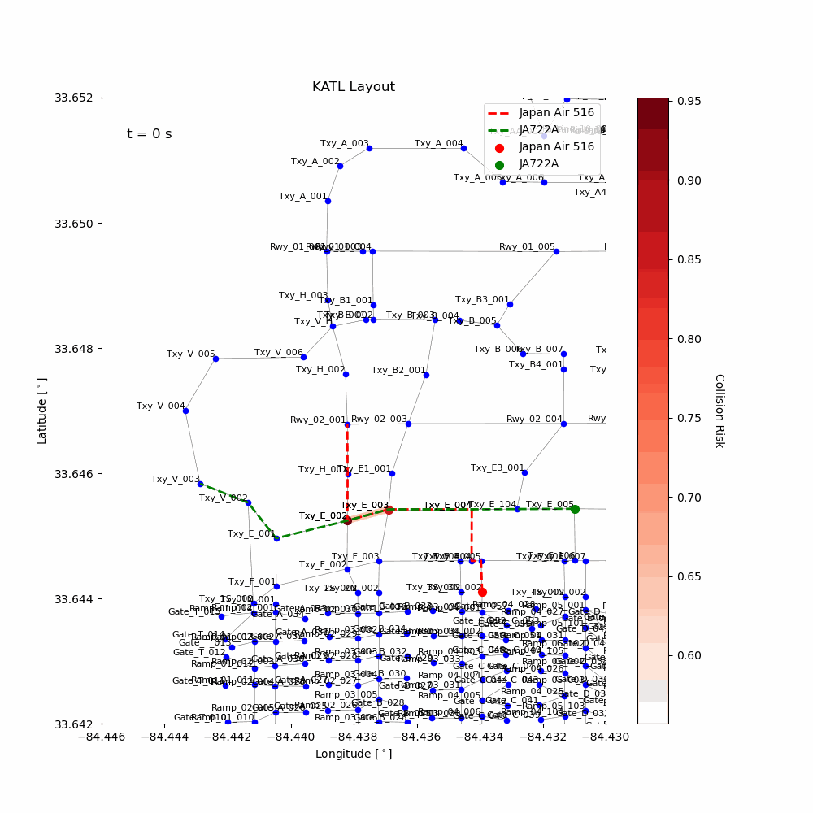

# Airport Surface Compliance Check and Collision Risk Assessment based on ATC Rule-enhanced ASR

This repository implements a rule-enhanced automatical speech recognition for air traffic communication transcript understanding, and build a collision risk assessment model from it, using the learned destination node similarities from NASA FACET airport node-link graphs.  

## Methodology Overview

**ATC Rule-enhanced ASR:**  

| **Embedding Model**               | **Augmented Data**         | **Post Prediction Screening** | **Precision** | **Recall** | **F1 Score** |
|-----------------------------------|----------------------------|--------------------------------|--------------|-----------|-------------|
| **Tok2Vec (Local-Contexual)**     | Training w/o ATC Rules     | No Override                   | 0.869         | 0.566     | 0.685       |
|                                   |                            | Override w/ ATC Rules         | 0.800         | 0.684     | 0.738       |
|                                   | Training w/ ATC Rules      | No Override                   | 0.839         | 0.684     | 0.754       |
|                                   |                            | Override w/ ATC Rules         | 0.841         | 0.763     | 0.800       |
| **BERT (Contextual)**             | Training w/o ATC Rules     | No Override                   | 0.847         | 0.546     | 0.664       |
|                                   |                            | Override w/ ATC Rules         | 0.781         | 0.658     | 0.714       |
|                                   | Training w/ ATC Rules      | No Override                   | 0.838         | 0.750     | 0.792       |
|                                   |                            | Override w/ ATC Rules         | 0.839         | 0.822     | 0.831       |
| **RoBERTa (Contextual)**          | Training w/o ATC Rules     | No Override                   | 0.859         | 0.559     | 0.677       |
|                                   |                            | Override w/ ATC Rules         | 0.805         | 0.678     | 0.736       |
|                                   | Training w/ ATC Rules      | No Override                   | 0.853         | 0.724     | 0.783       |
|                                   |                            | Override w/ ATC Rules         | 0.855         | 0.816     | 0.835       |
| **mBERT (Multilingual)**          | Training w/o ATC Rules     | No Override                   | 0.871         | 0.533     | 0.661       |
|                                   |                            | Override w/ ATC Rules         | 0.817         | 0.678     | 0.741       |
|                                   | Training w/ ATC Rules      | No Override                   | 0.869         | 0.783     | 0.824       |
|                                   |                            | Override w/ ATC Rules         | 0.866         | 0.809     | 0.837       |
| **mRoBERTa (Multilingual)**       | Training w/o ATC Rules     | No Override                   | **0.872**     | 0.539     | 0.667       |
|                                   |                            | Override w/ ATC Rules         | 0.820         | 0.691     | 0.750       |
|                                   | Training w/ ATC Rules      | No Override                   | 0.850         | 0.711     | 0.774       |
|                                   |                            | Override w/ ATC Rules         | 0.856         | 0.822     | 0.839       |
| **DistillBERT (Distilled)**       | Training w/o ATC Rules     | No Override                   | 0.856         | 0.546     | 0.667       |
|                                   |                            | Override w/ ATC Rules         | 0.800         | 0.711     | 0.753       |
|                                   | Training w/ ATC Rules      | No Override                   | 0.831         | 0.711     | 0.766       |
|                                   |                            | Override w/ ATC Rules         | 0.840         | 0.796     | 0.818       |
| **BART (Generative)**             | Training w/o ATC Rules     | No Override                   | 0.840         | 0.691     | 0.758       |
|                                   |                            | Override w/ ATC Rules         | 0.787         | 0.730     | 0.758       |
|                                   | Training w/ ATC Rules      | No Override                   | 0.845         | 0.822     | 0.833       |
|                                   |                            | Override w/ ATC Rules         | 0.842         | **0.842** | **0.842**   |

**Travel Time Modeling:**  
The $k$-th aircraft travels a total of $n$ taxiway links until reaching the certain spot of interest (i.e., potential collision spot), where the total travel time is given by $\Gamma_k$. We assume each taxiway link has an associated distance $d_{k,i}$ and a taxi speed $v_{k,i}$ that is log-normally distributed with parameters $\mu_{k,i}$ and $\sigma_{k,i}^2$, which is

$$
v_{k,i} \sim \mathrm{Lognormal}(\mu_{k,i}, \sigma^2_{k,i}).
$$

or,

$$
f_{v_{k,i}}(v_{k,i}) = \frac{1}{v_{k,i}\,\sigma_{k,i}\sqrt{2\pi}}
\exp\!\Bigl(-\frac{(\ln v_{k,i} - \mu_{k,i})^2}{2\,\sigma_{k,i}^2}\Bigr),
\quad \forall\,v_{k,i} > 0.
$$

It is obvious that $\Gamma_k = \sum_{i=0}^n \tau_{k,i}$ where $\tau_{k,i} = \tfrac{d_{k,i}}{v_{k,i}}$ is the distribution of the $k$-th aircraft travel time duration for the $i$-th node link. By the standard formula for transformations of random variables, if $\tau_{k,i} = g(v_{k,i}) = \tfrac{d_{k,i}}{v_{k,i}}$, then:

$$
f_{\tau_{k,i}}(\tau_{k,i}) =
f_{v_{k,i}}\bigl(g^{-1}(\tau_{k,i})\bigr)\;\left|\frac{d}{d\tau_{k,i}}\,g^{-1}(\tau_{k,i})\right|.
$$

where $g^{-1}(\tau_{k,i}) = \tfrac{d_{k,i}}{\tau_{k,i}}$ gives us

$$
\begin{aligned}
f_{\tau_{k,i}}(\tau_{k,i})
&= f_{v_{k,i}}\!\Bigl(\tfrac{d_{k,i}}{\tau_{k,i}}\Bigr) \;\cdot \left|\frac{d}{d\tau_{k,i}}\Bigl(\tfrac{d_{k,i}}{\tau_{k,i}}\Bigr)\right| \\
&= f_{v_{k,i}}\!\Bigl(\tfrac{d_{k,i}}{\tau_{k,i}}\Bigr)\;\cdot \frac{d_{k,i}}{\tau_{k,i}^2} \\
&= \frac{1}{\Bigl(\tfrac{d_{k,i}}{\tau_{k,i}}\Bigr)\,\sigma_{k,i}\sqrt{2\pi}}
\exp\!\Bigl[-\tfrac{\bigl(\ln(\tfrac{d_{k,i}}{\tau_{k,i}}) - \mu_{k,i}\bigr)^2}{2\,\sigma_{k,i}^2}\Bigr]
\;\cdot \frac{d_{k,i}}{\tau_{k,i}^2} \\
&= \frac{1}{\sigma_{k,i}\sqrt{2\pi}}\;\frac{1}{\tau_{k,i}}
\exp\!\Bigl[-\tfrac{1}{2\,\sigma_{k,i}^2}\,\bigl(\ln\!\bigl(\tfrac{d_{k,i}}{\tau_{k,i}}\bigr) - \mu_{k,i}\bigr)^2\Bigr] \\
&= \frac{1}{\tau_{k,i}\,\sigma_{k,i}\,\sqrt{2\pi}}
\exp\!\Bigl[-\,\frac{\bigl(\ln \tau_{k,i} - [\ln d_{k,i} - \mu_{k,i}]\bigr)^2}{2\,\sigma_{k,i}^2}\Bigr],
\quad \forall\,\tau_{k,i} > 0.
\end{aligned}
$$

That is, each $\tau_{k,i}$ is a lognormal-type variable, with parameters shifted by $\ln d_{k,i}$:

$$
\tau_{k,i} \sim \mathrm{Lognormal}\bigl(\ln d_{k,i} - \mu_{k,i}, \sigma^2_{k,i}\bigr).
$$

with

$$
\mathbb{E}[\tau_{k,i}] = d_{k,i}\,\exp\!\Bigl[-\mu_{k,i} + \tfrac{\sigma_{k,i}^2}{2}\Bigr],
\quad
Var[\tau_{k,i}] = d_{k,i}^2\,\exp\!\Bigl(-2\mu_{k,i} + \sigma_{k,i}^2\Bigr)\bigl[\exp\!\bigl(\sigma_{k,i}^2\bigr) - 1\bigr].
$$

The total travel time for the $k$-th aircraft, $\Gamma_k$, is the $n$-fold convolution of each individual link distribution as:

\[
f_{\Gamma_k}(t_k)
= [f_{\tau_{k,1}}(\tau_{k,1}) \circledast f_{\tau_{k,2}}(\tau_{k,2}) \circledast \cdots \circledast f_{\tau_{k,n}}(\tau_{k,n})](t_k)
\]

where $\circledast$ is the distribution convolution symbol.

In practice, we approximate $f_{\Gamma_k}(t_k)$ for any time $t_k>0$ by either Monte Carlo Simulations or Moment-Matching Approximations. For the convolution of log-normal distributions with moderate variance and $n_k$, the Fenton-Wilkinson approach provides a feasible solution to directly match the first two moments, and is widely adopted as the approximated analytical solution of log-normal sums in various fields [see, e.g., Mehta (2007), Cobb (2012)].

That is, we look for parameters of an approximate distribution $\Gamma_k \approx X_k^*$ where

$$
X_k^* \sim \mathrm{Lognormal}(\mu_k^*, \sigma_k^{*2}).
$$

where

$$
\mu_k^* = \ln M_k - \tfrac12 \ln(1 + \tfrac{V_k}{M_k^2}),
\quad
\sigma_k^{*2} = \ln(1 + \tfrac{V_k}{M_k^2}).
$$

with

$$
M_k = \sum_{i=1}^{n_k} \mathbb{E}[\tau_{k,i}],
\quad
V_k = \sum_{i=1}^{n_k} \mathrm{Var}[\tau_{k,i}].
$$

  Each taxiway link has an associated distance (computed from latitude and longitude using the haversine formula) and speed parameters (mu and sigma) determined by the link type. For example:
  - If both nodes are of type `Rwy` (Runway), then the speed parameters are `(30, 10)`.
  - If one node is `Rwy` and the other is `Txy` (Taxiway), then the parameters are `(25, 5)`.
  - If both nodes are `Txy`, then the parameters are `(20, 5)`.
  - For other node types (e.g., `Ramp`, `Gate`), the default parameters are `(15, 5)`.

**Collision Risk Calculation:**  
The collision happens when the two aircraft arrive simultaneously at the potential collision spot from the airport node-link graph (i.e., \(\Gamma_1 = \Gamma_2\) theoretically). Thus, the collision risk is measured by the density of the difference:

$$
\digamma = \Gamma_1 - \Gamma_2.
$$

Evaluated at \(\digamma=0\), this is given by:

$$
f_\digamma(\digamma = 0) = \int_0^\infty f_{\Gamma_1}(t)\, f_{\Gamma_2}(t)\, dt.
$$

### Case Study I: 2024 Henada Airport Runway Incursion
#### ATC Rule-enhanced ASR Results

| **TIME**  | **CALLSIGN**     | **ACSTATE**        | **DEST_RUNWAY** | **DESTINATION**        |
|-----------|------------------|--------------------|-----------------|------------------------|
| 17:43:02  | Japan Air 516     | approach, departure | 34R             | Rwy_03_001             |
| 17:43:12  | Japan Air 516     | approach           | 34R             | Rwy_03_001             |
| 17:43:26  | Delta 276         | taxi               | 34R             | Txy_C1_C (holding point C1) |
| 17:44:56  | Japan Air 516     | cleared, land      | 34R             | Rwy_03_001             |
| 17:45:01  | Japan Air 516     | cleared, land      | 34R             | Rwy_03_001             |
| 17:45:11  | JA722A            | taxi               |                 | Txy_C5_C5B (holding point C5) |
| 17:45:19  | JA722A            | taxi               |                 | Txy_C5_C5B (holding point C5) |
| 17:45:40  | Japan Air 179     | taxi               |                 | Txy_C1_C (holding point C1) |
| 17:45:56  | Japan Air 166     | approach           | 34R             | Rwy_03_001             |
| 17:47:23  | Japan Air 166     | approach           | 34R             |                        |
| 17:47:27  | Japan Air 166     |                    | 34R             |                        |
| 17:47:30  | Japan Air 516     | collision          |                 |                        |
| 17:47:30  | JA722A            | collision          |                 |                        |

#### Collision Risk Assessment

### Case Study II: 2024 KATL Taxiway Collision
#### ATC Rule-enhanced ASR Results

| **CALLSIGN**    | **TIME**  | **AC_STATE**          | **DEST_RUNWAY** | **DESTINATION**        |
|-----------------|-----------|-----------------------|-----------------|------------------------|
| Delta 295       | 0:08      | taxi                  | 08R             | Romeo                  |
| Delta 295       | 0:14      | taxi                  | 08R             | Rwy_02_001             |
| Delta 295       | 0:20      | Taxi                  | 08R             | foxtrot                |
| Delta 295       | 0:33      | continue, hold        | 08R             | ramp 5                 |
| Delta 295       | 0:44      | give way, inbound, join | 08R           | Echo                   |
| Delta 295       | 0:50      | give way              | 08R             |                        |
| Endeavor 5526   | 0:57      | taxi                  | 08R             | Rwy_02_001             |
| Delta 295       | 1:27      | go                    | 08R             |                        |
| Delta 295       | 1:35      | continue, hold        | 08R             |                        |
| Delta 295       | 1:45      | holding               | 08R             | Victor                 |
| Endeavor 5526   | 1:54      | line up, wait         | 08R             |                        |
| Endeavor 5526   | 2:10      | collision             |                 |                        |
| Delta 295       | 2:10      | collision             |                 |                        |

#### Collision Risk Assessment

