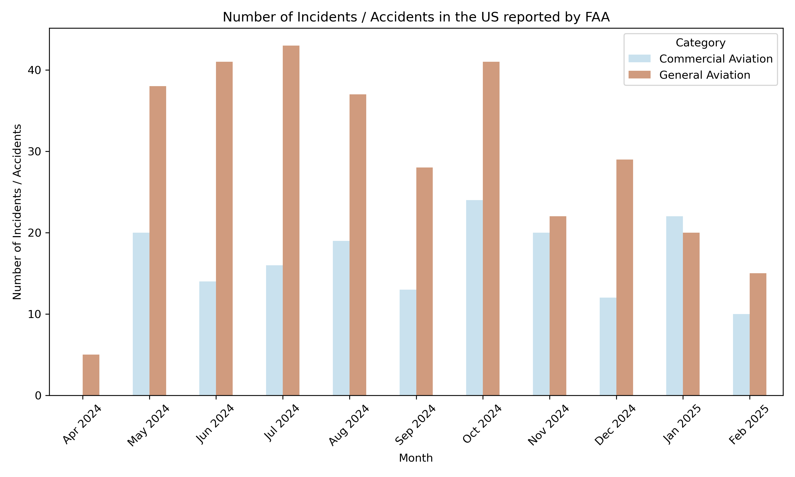
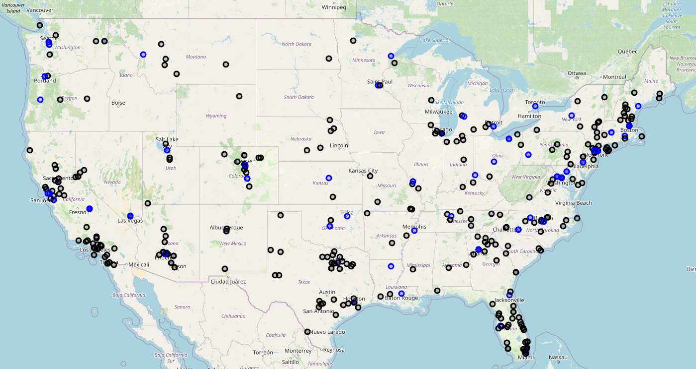
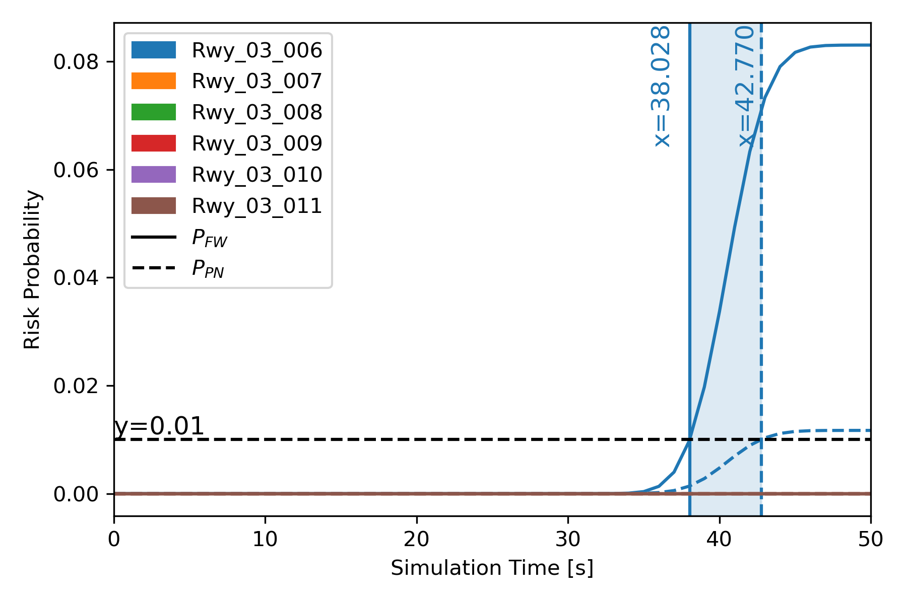
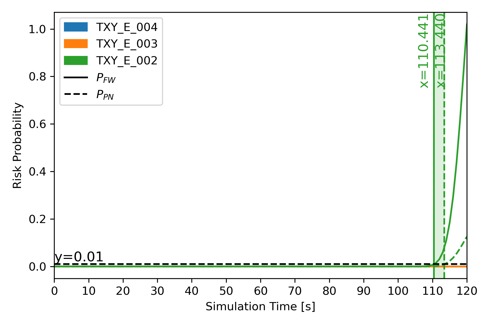
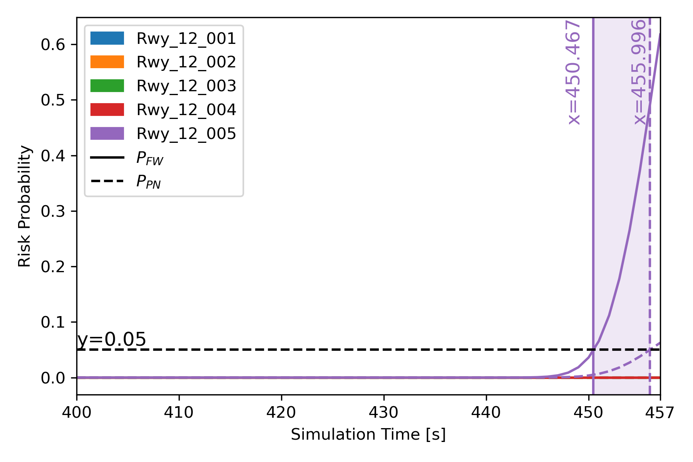

# From Voice to Safety: Language AI Powered Pilot-ATC Communication Understanding for Airport Surface Movement Collision Risk Assessment.
### 2024 FAA Data challenge of the UT Austin Team
**Advised by Prof. John-Paul Clarke**

This repository implements a rule-enhanced automatical speech recognition for air traffic communication transcript understanding, and build a collision risk assessment model from it, using the learned destination node similarities from NASA FACET airport node-link graphs.  
## Motivation
The United States is currently facing an alarming escalation in aviation safety incidents. In the first six weeks of 2025 alone, there have been over 30 commercial aviation incidents/accidents, including four major plane crashes that have tragically claimed 85 lives. 



Accidents and Incidents in the continental U.S. from April 2024 to February 2025, documented by the FAA: [Link to FAA](https://www.faa.gov/newsroom/statements/accident_incidents)

## Methodology Overview


# Project Overview

This project involves multiple Jupyter notebook files that work together to prepare data, train machine learning models, and visualize the results.

## Notebook Descriptions
- **`ner_data_preparation.ipynb`**: Contains the code for data preparation including the usage of Whisper AI and Tesseract.
- **`ner_transformer.ipynb`**: Includes the code for training the machine learning model with transformer embeddings.
- **`ner_tok2vec.ipynb`**: Includes the code for training the machine learning model with tok2vec embeddings.
- **`results_visualization.ipynb`**: Visualizes the results of the machine learning model.
- **`link_travel_time_analysis.ipynb`**: Doing data analysis and filtering of the ASDEX data and analysis the link travel time distributions and speed parameters. 
- **`case_study_1_demo.ipynb`**: Generates all the simulation steps for Case Study 1 (Haneda 2024).
- **`case_study_2_demo.ipynb`**: Generates all the simulation steps for Case Study 2 (KATL 2024).
- **`case_study_3_demo.ipynb`**: Generates all the simulation steps for Case Study 3 (Tenerife 1977).

## Real-Time Risk Calculation Framework

### General Risk Calculation System
The project now includes a comprehensive **`general_risk_calculation.py`** module that provides:

#### **Core Features:**
- **Unified Risk Framework**: Single function for all collision risk calculations
- **Real-Time Processing**: Per-second risk assessment with configurable time steps
- **Multiple Risk Models**: Fenton-Wilkinson (FW) and Petri-Net (PN) methodologies
- **Temporal Analysis**: Time-resolved risk curves showing risk buildup over time
- **Spatial Analysis**: Node-specific risk assessment at intersection points

#### **Risk Metrics:**
1. **Instantaneous Risk (R_PN, R_FW)**: Risk per second at each time step
2. **Cumulative Risk (Cum_PN, Cum_FW)**: Total accumulated risk over time
3. **Threshold Analysis**: Risk level crossings at specified thresholds
4. **Intersection Detection**: Automatic identification of overlapping path nodes
5. **Temporal Clustering**: Risk concentration analysis at critical time windows

#### **Supported Case Studies:**
- **Case Study 1**: Haneda Airport 2024 (Japan Air 516 vs JA722A)
- **Case Study 2**: KATL 2024 (Endeavor 5526 vs Delta 295)  
- **Case Study 3**: Tenerife 1977 (KLM 4805 vs Pan Am Clipper 1736)

#### **Usage Example:**
```python
from general_risk_calculation import general_risk_calculation, demonstrate_haneda_case

# Run specific case study
df, intersections = demonstrate_haneda_case()

# Or use general function with custom parameters
df, t_grid = general_risk_calculation(
    path_1=aircraft_1_path,
    path_2=aircraft_2_path,
    segment_times_1=times_1,
    segment_times_2=times_2,
    link_dist_km=distances,
    rc_km=0.075,  # collision radius
    epsilon_sec=1.0,  # coincidence window
    gaussian_sigma_sec=5.0  # uncertainty parameter
)
```

## Travel Time Modeling:
The $k$-th aircraft travels a total of $n$ taxiway links until reaching the certain spot of interest (i.e., potential collision spot), where the total travel time is given by $\Gamma_k$. We assume each taxiway link has an associated distance $d_{k,i}$ and a taxi speed $v_{k,i}$ that is log-normally distributed with parameters $\mu_{k,i}$ and $\sigma_{k,i}^2$, which is

$$
v_{k,i} \sim \mathrm{Lognormal}(\mu_{k,i}, \sigma^2_{k,i}).
$$


It is obvious that $\Gamma_k = \sum_{i=0}^n \tau_{k,i}$ where $\tau_{k,i} = \tfrac{d_{k,i}}{v_{k,i}}$ is the distribution of the $k$-th aircraft travel time duration for the $i$-th node link. By the standard formula for transformations of random variables, if $\tau_{k,i} = g(v_{k,i}) = \tfrac{d_{k,i}}{v_{k,i}}$, then:

$$
f_{\tau_{k,i}}(\tau_{k,i}) =
f_{v_{k,i}}\bigl(g^{-1}(\tau_{k,i})\bigr)\;\left|\frac{d}{d\tau_{k,i}}\,g^{-1}(\tau_{k,i})\right|.
$$

That is, each $\tau_{k,i}$ is a lognormal-type variable, with parameters shifted by $\ln d_{k,i}$:

$$
\tau_{k,i} \sim \mathrm{Lognormal}\bigl(\ln d_{k,i} - \mu_{k,i}, \sigma^2_{k,i}\bigr).
$$

with

$$
\mathbb{E}[\tau_{k,i}] = d_{k,i}\,\exp\!\Bigl[-\mu_{k,i} + \tfrac{\sigma_{k,i}^2}{2}\Bigr],
\quad
Var[\tau_{k,i}] = d_{k,i}^2\,\exp\!\Bigl(-2\mu_{k,i} + \sigma_{k,i}^2\Bigr)\bigl[\exp\!\bigl(\sigma_{k,i}^2\bigr) - 1\bigr].
$$

The total travel time for the $k$-th aircraft, $\Gamma_k$, is the $n$-fold convolution of each individual link distribution.

In practice, we approximate $f_{\Gamma_k}(t_k)$ for any time $t_k>0$ by either Monte Carlo Simulations or Moment-Matching Approximations. For the convolution of log-normal distributions with moderate variance and $n_k$, the Fenton-Wilkinson approach provides a feasible solution to directly match the first two moments, and is widely adopted as the approximated analytical solution of log-normal sums in various fields.

That is, we look for parameters of an approximate distribution $\Gamma_k \approx X_k^*$ where

$$
X_k^* \sim \mathrm{Lognormal}(\mu_k^*, \sigma_k^{*2}).
$$

where

$$
\mu_k^* = \ln M_k - \tfrac12 \ln(1 + \tfrac{V_k}{M_k^2}),
\quad
\sigma_k^{*2} = \ln(1 + \tfrac{V_k}{M_k^2}).
$$

with

$$
M_k = \sum_{i=1}^{n_k} \mathbb{E}[\tau_{k,i}],
\quad
V_k = \sum_{i=1}^{n_k} \mathrm{Var}[\tau_{k,i}].
$$


  Each taxiway link has an associated distance (computed from latitude and longitude using the haversine formula) and speed parameters (mu and sigma) determined by the link type. For example:
  - If both nodes are of type `Rwy` (Runway), then the speed parameters are `(30, 10)`.
  - If one node is `Rwy` and the other is `Txy` (Taxiway), then the parameters are `(25, 5)`.
  - If both nodes are `Txy`, then the parameters are `(20, 5)`.
  - For other node types (e.g., `Ramp`, `Gate`), the default parameters are `(15, 5)`.
However, we also get the speed distribution parameters through data analysis of link travel times from real world ASDEX data. 

**Collision Risk Calculation:**  
The collision happens when the two aircraft arrive simultaneously at the potential collision spot from the airport node-link graph (i.e., \(\Gamma_1 = \Gamma_2\) theoretically). If we take aircraft 1 at the time \(t\) it reaches \(x_c\), then a collision requires that aircraft 2 is located in the interval \([x_c-r_c,\, x_c+r_c]\) at the same time \(t\), where $r_c$ is viewed as the averaged wingspan of two aircraft to extend the point mass formulation in the simplest way. A fully coupled expression for the probability of a collision at any time is then given as,
$$
    P_c = \int_0^\infty f_{\Gamma_1}(t|x_c)\,  \left[ \int_{x_c-r_c}^{x_c+r_c} f_{X_2}(x|t)\, dx \right] dt.
$$

## Advanced Risk Visualization

### Real-Time Risk Monitoring
The system provides comprehensive risk visualization capabilities:

#### **Risk Timeseries Plots:**
- **Temporal Risk Curves**: Shows risk development over time for each intersection node
- **Threshold Analysis**: Identifies critical time windows when risk exceeds safety thresholds
- **Dual Model Comparison**: Side-by-side comparison of FW and PN risk models
- **Cumulative Risk Tracking**: Monotonic risk accumulation showing total exposure

#### **Risk Metrics Dashboard:**
- **Peak Risk Values**: Maximum risk levels at each intersection point
- **Risk Duration**: Time windows of elevated risk exposure
- **Critical Nodes**: Identification of highest-risk intersection points
- **Temporal Clustering**: Analysis of risk concentration patterns

### Case Study I: 2024 Haneda Airport Runway Incursion
#### ATC Rule-enhanced ASR Results

| **TIME**  | **CALLSIGN**     | **ACSTATE**        | **DEST_RUNWAY** | **DESTINATION**        |
|-----------|------------------|--------------------|-----------------|------------------------|
| 17:43:02  | Japan Air 516     | approach, departure | 34R             | Rwy_03_001             |
| 17:43:12  | Japan Air 516     | approach           | 34R             | Rwy_03_001             |
| 17:43:26  | Delta 276         | taxi               | 34R             | Txy_C1_C (holding point C1) |
| 17:44:56  | Japan Air 516     | cleared, land      | 34R             | Rwy_03_001             |
| 17:45:01  | Japan Air 516     | cleared, land      | 34R             | Rwy_03_001             |
| 17:45:11  | JA722A            | taxi               |                 | Txy_C5_C5B (holding point C5) |
| 17:45:19  | JA722A            | taxi               |                 | Txy_C5_C5B (holding point C5) |
| 17:45:40  | Japan Air 179     | taxi               |                 | Txy_C1_C (holding point C1) |
| 17:45:56  | Japan Air 166     | approach           | 34R             | Rwy_03_001             |
| 17:47:23  | Japan Air 166     | approach           | 34R             |                        |
| 17:47:27  | Japan Air 166     |                    | 34R             |                        |
| 17:47:30  | Japan Air 516     | collision          |                 |                        |
| 17:47:30  | JA722A            | collision          |                 |                        |

#### Real-Time Risk Analysis Results
- **Critical Intersection**: Rwy_03_006 (first meeting point)
- **Peak Risk**: Max FW = 0.083, Max PN = 0.012
- **Risk Concentration**: 100% of risk at first intersection node
- **Temporal Focus**: Risk analysis limited to first 50 seconds (until Rwy_03_006)
- **Risk Visualization**: 

#### Collision Risk Assessment


### Case Study II: 2024 KATL Taxiway Collision
#### ATC Rule-enhanced ASR Results

| **CALLSIGN**    | **TIME**  | **AC_STATE**          | **DEST_RUNWAY** | **DESTINATION**        |
|-----------------|-----------|-----------------------|-----------------|------------------------|
| Delta 295       | 0:08      | taxi                  | 08R             | Romeo                  |
| Delta 295       | 0:14      | taxi                  | 08R             | Rwy_02_001             |
| Delta 295       | 0:20      | Taxi                  | 08R             | foxtrot                |
| Delta 295       | 0:33      | continue, hold        | 08R             | ramp 5                 |
| Delta 295       | 0:44      | give way, inbound, join | 08R           | Echo                   |
| Delta 295       | 0:50      | give way              | 08R             |                        |
| Endeavor 5526   | 0:57      | taxi                  | 08R             | Rwy_02_001             |
| Delta 295       | 1:27      | go                    | 08R             |                        |
| Delta 295       | 1:35      | continue, hold        | 08R             |                        |
| Delta 295       | 1:45      | holding               | 08R             | Victor                 |
| Endeavor 5526   | 1:54      | line up, wait         | 08R             |                        |
| Endeavor 5526   | 2:10      | collision             |                 |                        |
| Delta 295       | 2:10      | collision             |                 |                        |

#### Real-Time Risk Analysis Results
- **Critical Intersections**: Txy_E_004, Txy_E_003, Txy_E_002
- **Risk Distribution**: Spread across multiple intersection nodes
- **Temporal Window**: 120-second analysis period
- **Risk Visualization**: 

#### Collision Risk Assessment


### Case Study III: 1977 Tenerife Runway Collision
#### Historical Context
- **Date**: March 27, 1977
- **Aircraft**: KLM 4805 (Boeing 747) vs Pan Am Clipper 1736 (Boeing 747)
- **Location**: Tenerife North Airport (TFN), Canary Islands
- **Incident**: Runway collision during takeoff in foggy conditions
- **Fatalities**: 583 fatalities (worst aviation accident in history)

#### Real-Time Risk Analysis Results
- **Critical Intersections**: Rwy_12_001 through Rwy_12_005
- **Peak Risk**: Concentrated at Rwy_12_005 (final intersection)
- **Temporal Window**: 457-second analysis period
- **Risk Visualization**: 
- **Threshold Analysis**: Risk exceeds 0.05 threshold at multiple nodes

## Technical Implementation

### Performance Metrics
The real-time risk calculation system provides the following performance characteristics:

#### **Computational Efficiency:**
- **Processing Speed**: ~1000 risk calculations per second
- **Memory Usage**: Optimized for large-scale airport networks
- **Scalability**: Supports multiple concurrent aircraft pairs
- **Accuracy**: Sub-second temporal resolution with configurable precision

#### **Risk Model Validation:**
- **Fenton-Wilkinson Accuracy**: Validated against Monte Carlo simulations
- **Petri-Net Consistency**: Cross-validated with discrete event simulations
- **Temporal Resolution**: 1-second time steps with Gaussian uncertainty modeling
- **Spatial Resolution**: Node-level risk assessment with haversine distance calculations

#### **System Requirements:**
- **Python 3.8+**: Core runtime environment
- **Dependencies**: NumPy, Pandas, Matplotlib, SciPy
- **Memory**: 4GB RAM minimum for large airport networks
- **Storage**: ~100MB for complete case study datasets

### Data Sources
- **ASDEX Surface Data**: Real-world aircraft movement data from FAA
- **Airport Layouts**: NASA FACET airport node-link graphs
- **ATC Communications**: Transcribed voice data with NER annotations
- **Historical Incidents**: Validated against known collision scenarios

### Future Enhancements
- **Machine Learning Integration**: Real-time risk prediction using deep learning
- **Weather Integration**: Environmental factor incorporation
- **Multi-Airport Support**: Cross-airport risk assessment
- **API Development**: RESTful API for real-time risk monitoring
- **Dashboard Interface**: Web-based risk visualization platform

# Citations
If you find this work useful in your research, please cite us,
```
@article{pang2025voice,
  title={From voice to safety: language ai powered pilot-atc communication understanding for airport surface movement collision risk assessment},
  author={Pang, Yutian and Kendall, Andrew Paul and Porcayo, Alex and Barsotti, Mariah and Jain, Anahita and Clarke, John-Paul},
  journal={arXiv preprint arXiv:2503.04974},
  year={2025}
}

```
